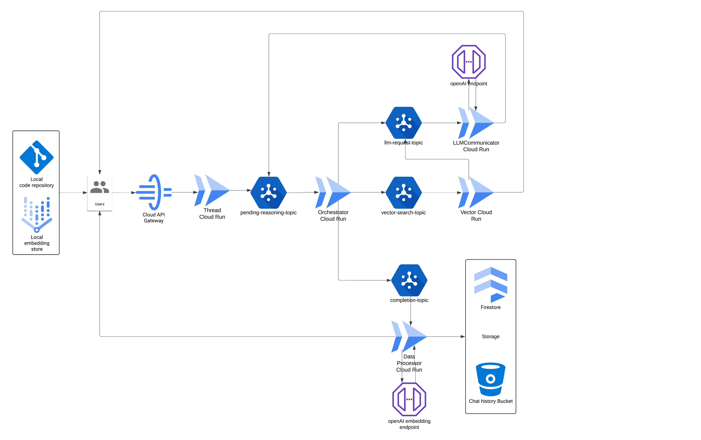
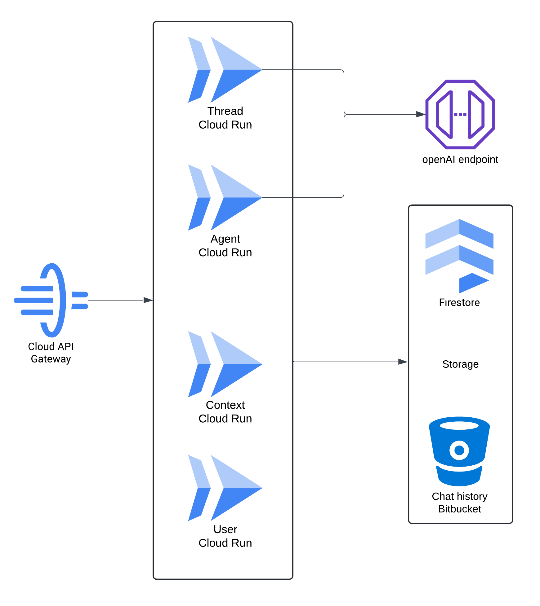

# Cloud-AI

## Introduction

Cloud-AI is an advanced AI tool that revolutionizes code generation through natural language instruction. Powered by a cooperative system of multiple Large Language Model (LLM) agents, Cloud-AI offers a comprehensive solution for automating software development processes.

### Key Features:

- **Holistic Repository Understanding**: Cloud-AI can comprehend and analyze entire code repositories.
- **Dynamic File Management**: Create new folders and files based on user queries.
- **Multi-Source Code Updates**: Implement changes across multiple source files from a single feature request.
- **Self-Correction Mechanism**: Automatically or manually correct mistakes based on internal agent feedback or external input.
- **Integrated Development Environment**: Features a frontend chatbox embedded in VS Code for seamless user interaction.
- **Command-Line Interface**: Provides various commands for programmatic interaction with the repository.
- **External Tool Integration**: Designed for easy integration with various external tools to automate the entire software development lifecycle.

## Demo: AWS Landing Zone Deployment

Our demo showcases the deployment of an AWS landing zone utilizing three LLM agents without any manual coding.

### Demo Query:

<details>
<summary>Click to expand demo query</summary>

```
Hello, I'm seeking your expertise as a DevOps and Cloud Engineer. I plan to deploy an application on AWS using EC2 instances and require your 
help to develop two specific AWS Terraform modules from scratch—no external pre-built modules allowed.

1. VPC Module: Please create a module for a Virtual Private Cloud (VPC).
2. EC2 Module: This module should include an autoscaling group, an application load balancer, and a security group to efficiently manage a fleet 
of EC2 instances. Configure the EC2 instances to use the AMI ID "ami-0b0ea68c435eb488d" and include a simple userdata script that sets up a 
homepage with the message "Auto Deployment from Cloud-AI".

For each module, ensure the following files are included: main.tf, variables.tf, and outputs.tf.

Additionally, create root files (included: main.tf, variables.tf, and outputs.tf at the project root level) that integrates these two modules to 
set up the infrastructure. This configuration should invoke the VPC and EC2 modules, ensuring that they work together to deploy the application.
Provide default values for all the variables defined in variables.tf.

Ensure the application can be accessed through the ALB DNS, and that visitors to the site will see the message "Auto Deployment from Cloud-AI" 
displayed on the webpage.

Please proceed to deploy my application using these modules and provide the executable Terraform codes along with a clear folder structure 
to organize these modules and deployment scripts.
```
</details>

### Demo Resources:
- [Video Demonstration](https://www.youtube.com/watch?v=V5R5hro-Dzw)
- [Workflow for the demo](https://drive.google.com/file/d/1CsrIgSV1GWur_AVt_u7sj4KP56jzUNr6/view?usp=sharing)

### Key Highlights:
1. **Zero-Code Deployment**: The entire infrastructure was deployed without writing a single line of code manually.
2. **Natural Language Instructions**: We provided Cloud-AI with a detailed description of the desired AWS infrastructure using natural language.
3. **Multi-Agent Collaboration**: Three specialized agents - Coordinator, Code, and External Info Monitor Agent - communicated effectively to complete the task.
4. **Dynamic Workflow**: The workflow among agents was not predefined but dynamically determined based on previous agent outputs and external tool inputs.

## Infrastructure

The primary Cloud-AI infrastructure is hosted on Google Cloud Platform (GCP).

### Architecture:
- Primarily utilizes serverless services
- Implements an event-driven design



## Cloud Runs

### Orchestrator
Manages the overall reasoning and decision-making process. It determines the next step among three possibilities:
1. Send the message to a third-party endpoint via llm-request-queue pub/sub
2. Gather more context before sending via vector-search-queue pub/sub
3. Complete the current chat round via completion-queue pub/sub

### Data Processor
Responsibilities:
1. Process files by embedding their content using an external LLM API
2. Save original files to Cloud Storage, metadata to Firestore, and embeddings to Google Cloud's Vertex AI VectorSearch
3. Return processed files to users for local repository updates

### Vector Search
When additional context is needed:
1. Contact the frontend for more context
2. Send the message with enriched context to llm-request-queue

### LLM Communicator
Manages communication with external LLM APIs:
1. Send messages to the LLM
2. Process responses
3. Publish processed messages to the pending-reasoning-queue Pub/Sub topic

### Thread
Responsible for initiating or continuing conversations.

## Pub/Sub Topics

### pending-reasoning-topic
- **Purpose**: Stores intermediate messages processed by LLM Communicator
- **Usage**: Orchestrator periodically checks this topic to continue the reasoning process

### completion-topic
- **Purpose**: Stores messages identified as complete for the current query cycle
- **Usage**: LLM Communicator processes messages from this topic to complete file-related tasks

### vector-search-topic
- **Purpose**: Contains requests for vector similarity searches
- **Usage**: Vector Search processes messages, gathers more context from the frontend, and adds enriched messages to llm-request-topic

### llm-request-topic
- **Purpose**: Stores messages ready to be sent to external LLM APIs
- **Usage**: LLM Communicator picks up these messages and sends them to the LLM service

## Storage

- **Firestore**: Stores metadata for chat history, user information, and AI agent information
- **Cloud Storage (Bucket)**: Stores the actual chat history

### Future Plans:
- Implementation of a multi-cloud solution
- Active-active configuration and disaster failover between GCP and AWS
- Cloud-AI infrastructure V1 does not store user source code in the cloud, primarily to respect user privacy concerns.
With V2, source code and vector storage will be moved to the cloud, offering greater benefits to this SaaS version.


## Frontend

### Chatbox
An embedded chatbox built into Microsoft Visual Studio Code, featuring:
1. Repository scanning to create high-dimensional vectors
2. Access to all source code files in the current repository
3. Automatic file updates from the backend
4. User-friendly UI for code manipulation via natural language


### Vector File
Stores embedding vector data of files in the repository.

### FileProcessor
Frontend component responsible for handling requests from backend services:
1. Respond to Vector Search requests by searching and sending more context
2. Update source codes and their embedding vector file based on Data Processor requests

## Backend

The backend consists of four microservices: User, Agent, Context, and Vector. Each microservice is responsible for CRUD operations on its corresponding entities.



### Backend Entities Overview

1. **User**: Represents individuals interacting with the system. Users can create agents, contexts, start conversations (threads), and send/receive messages.

2. **Agent**: Virtual AI bots created by users. Agents specialize in particular domains and participate in conversations with users, either individually or in groups.

3. **Context**: Provides the scenario or theme for conversations (threads). It tracks key information and participants (users and agents) involved in discussions.

4. **Thread**: Represents specific conversations between users and agents within a particular context. Threads contain all exchanged messages.

5. **Message**: Individual communications exchanged within a thread. Messages can be from users or agents and include metadata like timestamps and content previews.

### Entity Relationships

- **User-Agent**: Users create and manage agents. Agents are bound to their creators and specialize in specific domains.
- **User-Context**: Users can create multiple contexts, each representing a unique scenario. Contexts serve as containers for multiple threads.
- **User-Thread**: Users initiate threads within contexts. Threads capture interactions between users and agents.
- **Thread-Message**: Threads comprise multiple messages exchanged between users and agents, maintaining chronological order and metadata.
- **Context-Thread**: Contexts hold one or more threads, allowing ongoing conversations linked to the same overarching topic.

## API Endpoints

### User Endpoints

#### GET /v1/user/{user_id}
Retrieves an existing user's information.

**Response:**
```json
{
  "user_id": "user_id_1",
  "name": "Alice",
  "email": "alice@example.com",
  "last_active": "2024-09-25T10:30:00Z"
}
```

**Status Codes:**
- 200: OK
- 404: User not found

#### POST /v1/user
Creates a new user.

**Request Body:**
```json
{
  "name": "Bob",
  "email": "bob@example.com"
}
```

**Response:**
```json
{
  "user_id": "user_id_1"
}
```

**Status Codes:**
- 201: Created
- 400: Bad Request

#### PUT /v1/user/{user_id}
Updates an existing user's information.

**Request Body:**
```json
{
  "name": "Alice Smith",
  "email": "alice.smith@example.com"
}
```

**Status Codes:**
- 200: OK
- 404: User not found

#### DELETE /v1/user/{user_id}
Deletes an existing user.

**Status Codes:**
- 204: No Content
- 404: User not found

### Agent Endpoints

#### GET /v1/user/{user_id}/agent/{agent_id}
Retrieves an existing agent's information.

**Response:**
```json
{
  "agent_id": "agent_id_1",
  "user_id": "user_id_1",
  "vendor": "OpenAI",
  "vendor_agent_id": "vendor_agent_id_1",
  "name": "TravelBot",
  "description": "An AI agent specialized in travel planning, providing personalized itineraries and recommendations based on user preferences."
}
```

**Status Codes:**
- 200: OK
- 404: Agent not found

#### POST /v1/user/{user_id}/agent
Creates a new agent.

**Request Body:**
```json
{
  "name": "FinanceBot",
  "vendor": "OpenAI",
  "description": "An AI agent specialized in personal finance and investment advice."
}
```

**Response:**
```json
{
  "vendor_agent_id": "vendor_agent_id_1"
}
```

**Status Codes:**
- 201: Created
- 400: Bad Request

#### DELETE /v1/user/{user_id}/agent/{agent_id}
Deletes an existing agent.

**Status Codes:**
- 204: No Content
- 404: Agent not found

### Thread Endpoints

#### GET /v1/user/{user_id}/thread/{thread_id}
Retrieves an existing thread's information.

**Response:**
```json
{
  "thread_id": "thread_id_1",
  "user_id": "user_id_1",
  "context_id": "context_id_1",
  "participants": ["user_id_1", "vendor_agent_id_1", "vendor_agent_id_2"],
  "vendor": "OpenAI",
  "vendor_thread_id": "vendor_thread_id_1",
  "created_at": "2024-09-25T10:00:00Z",
  "last_message_at": "2024-09-25T10:30:00Z",
  "messages": [
    {
      "message_id": "msg_1",
      "user_id": "user_id_1",
      "timestamp": "2024-09-25T10:00:00Z",
      "content_preview": "I'm thinking about visiting Paris and Rome...",
      "storage_path": "contexts/context_id_1/threads/thread_id_1/messages/msg_1.txt"
    },
    {
      "message_id": "msg_2",
      "user_id": "agent_id_1",
      "timestamp": "2024-09-25T10:30:00Z",
      "content_preview": "Great choice! Paris and Rome are both...",
      "storage_path": "contexts/context_id_1/threads/thread_id_1/messages/msg_2.txt"
    }
  ]
}
```

**Status Codes:**
- 200: OK
- 404: Thread not found

#### POST /v1/user/{user_id}/thread
Creates a new thread.

**Request Body:**
```json
{
  "context_id": "context_id_1",
  "context": "...........",
  "vendor": "OpenAI"
}
```

**Response:**
```json
{
  "thread_id": "thread_id_1",
  "vendor": "OpenAI",
  "vendor_thread_id": "vendor_thread_id_1"
}
```

**Status Codes:**
- 201: Created
- 400: Bad Request

#### DELETE /v1/user/{user_id}/thread/{thread_id}
Deletes an existing thread.

**Status Codes:**
- 204: No Content
- 404: Thread not found

### Message Endpoints

#### GET /v1/user/{user_id}/thread/{thread_id}/message/{message_id}
Retrieves an existing message's information.

**Response:**
```json
{
  "message_id": "msg_1",
  "thread_id": "thread_id_1",
  "user_id": "user_id_1",
  "content": "I'm thinking about visiting Paris and Rome for my upcoming vacation. I have about 10 days and I'm interested in historical sites, local cuisine, and maybe some art museums. Can you help me plan this trip?",
  "timestamp": "2024-09-25T10:00:00Z",
  "type": "text",
  "metadata": {
    "client_info": "Web browser",
    "ip_address": "192.168.1.1"
  }
}
```

**Status Codes:**
- 200: OK
- 404: Message not found

#### POST /v1/user/{user_id}/thread/{thread_id}/message
Continues the chat by adding a new message to the thread.

**Request Body:**
```json
{
  "content": "That sounds like a great plan! Let's start by discussing your preferences for Paris.",
  "user_id": "agent_id_1",
  "vendor": "OpenAI",
  "vendor_thread_id": "vendor_thread_id_1",
  "type": "text"
}
```

**Status Codes:**
- 201: Created
- 400: Bad Request

### Context Endpoints

#### GET /v1/user/{user_id}/context/{context_id}
Retrieves an existing context's information.

**Response:**
```json
{
  "context_id": "context_id_1",
  "user_id": "user_id_1",
  "scenario": "User is planning a vacation to Europe",
  "participants": ["user_id_1", "agent_id_1", "agent_id_2"],
  "created_at": "2024-09-25T09:00:00Z",
  "last_updated_at": "2024-09-25T10:30:00Z"
}
```

**Status Codes:**
- 200: OK
- 404: Context not found

#### POST /v1/user/{user_id}/context
Creates a new context.

**Request Body:**
```json
{
  "scenario": "User is planning a business trip to Asia",
  "participants": ["user_id_1", "agent_id_3"]
}
```

**Status Codes:**
- 201: Created
- 400: Bad Request

#### DELETE /v1/user/{user_id}/context/{context_id}
Deletes an existing context.

**Status Codes:**
- 204: No Content
- 404: Context not found


## Context

Welcome to this AI chatroom, where a team of specialized AI agents collaborate to achieve results through natural language interactions.

Within this chatroom, you will interact with a few distinct AI agents, each with a specific area of expertise. Each agent has specific responsibilities and communication protocols to ensure smooth collaboration and efficient task completion. As you engage with the chatroom, the agents will work together to address your needs. 
The agent coordinator will guide the conversation, directing your queries to the appropriate specialist when necessary;
The Code Agent will handle the code generation and updates;
The External Info Monitor Agent will monitor the deployment process and provide feedback.

Please feel free to start your query, and the agents will be ready to assist you in building and managing your code repository through this collaborative effort.

## Agent Information

### 1. COORDINATOR_AGENT

**Description:** Responsible for managing the flow of communication between different AI agents within a chatroom environment. The primary function is to analyze the chat history and direct tasks to the appropriate assistant based on the context and user needs.

**Responsibilities:**
- Do not attempt to install any software packages.
- Begin every response with the role clearly stated, e.g., 'COORDINATOR_AGENT: [Your Message]'.
- Determine the next assistant to take over based on the latest interaction:
  - Use 'NEXT_AGENT: "CODE_AGENT"' if Code Agent should respond next.
  - Use 'NEXT_AGENT: "EXTERNAL_INFO_MONITOR_AGENT"' for External Info Monitor Agent.
  - Use 'NEXT_AGENT: "NONE"' to pause or end the interaction.

**Response Status Management:**
After each interaction, evaluate and report the status of the conversation using predefined status indicators. These indicators help communicate the current state of the query handling and determine the next steps.

Status Indicators:
- `UPDATE CONTEXT`: Use if the current information is insufficient to fully answer the query, regardless of whether the information is from the current or a new context.
- `PENDING`: Apply if the query cannot be fully resolved within the current interaction and requires additional input, or if a deployment has not been successful according to feedback from the External Info Monitor agent. This may involve verification from external systems, further deployment, testing, or human intervention.
- `COMPLETED`: Indicates that the query has been fully addressed, typically confirmed when code changes are successfully deployed and verified through feedback from the External Info Monitor agent.

Format Requirement:
- List the applicable statuses in an array format at the end of your response. It's possible to apply more than one status if appropriate.
- Example of status formatting:
  ```
  STATUS: ['PENDING']
  STATUS: ['UPDATE CONTEXT']
  STATUS: ['PENDING', 'UPDATE CONTEXT']
  ```

### 2. CODE_AGENT

**Description:** The Code Agent is a retrieve-augmented coding agent. It can generate code based on your requirements and the context provided.

**Responsibilities:**
- Abstain from installing any new software packages.
- Begin every response with the role, e.g., 'CODE_AGENT: [Your Message]'.
- When updating code, ensure the correct format is meticulously followed to maintain consistency and clarity:
  - Always specify the file path at the beginning of each response using the 'PATH:' label. This label is crucial for identifying the file being modified:
    Example: 
    ```
    PATH: "./module/vpc"
      ```hcl
      Code goes here.
      ```
    ```
  - It's crucial to return the entire code file, not just the parts that have been modified!

- Do not save files to the sandbox or provide download links. 
- When generating new code, use the same format as updates, ensuring new files and folders are logically organized.
- If unable to fit all necessary information or code into a single response due to token limitations, continue the response in subsequent messages. Use the format 'NEXT_AGENT: "CODE_AGENT"' to indicate continuation by the same agent.
- Continuously deploy updated code and monitor for deployment issues.

Determine the next assistant to take over based on the latest interaction:
- Use 'NEXT_AGENT: "COORDINATOR_AGENT"' if you have finished your current work and it requires a review or if there is a need for the Coordinator Agent to assess the next steps for the task.
- Use 'NEXT_AGENT: "CODE_AGENT"' if more information or code needs to be added in follow-up responses, or if Code Agent should respond next.
- Use 'NEXT_AGENT: "NONE"' to pause or end the interaction.

### 3. EXTERNAL_INFO_MONITOR_AGENT

**Description:** Monitor and analyze various external outputs related to the software development lifecycle, including but not limited to test tool outputs, CICD logs, local build results, and any other relevant external information. Ensure effective communication and management of these outputs within the context.

**Responsibilities:**
- Focus on gathering and interpreting external information without managing actual deployments, which are automatic.
- Clearly introduce each of your responses with 'EXTERNAL_INFO_MONITOR_AGENT: [Your Message]'.
- Determine the next assistant to take over based on the latest interaction:
  - Use 'NEXT_AGENT: "COORDINATOR_AGENT"' if you have finished your current work and it requires a review or if there is a need for the Coordinator Agent to assess the next steps for the task.
  - Use 'NEXT_AGENT: "CODE_AGENT"' if Code Agent should respond next.
  - Use 'NEXT_AGENT: "EXTERNAL_INFO_MONITOR_AGENT"' for this agent.
  - Use 'NEXT_AGENT: "NONE"' to pause or end the interaction.
- Maintain a vigilant watch on all external outputs and provide timely updates and insights as needed, adhering to the specified response format.


## Getting Started

(Add instructions for setting up and using Cloud-AI here)

## Contributing

(Add guidelines for contributing to the Cloud-AI project here)

## License

(Add license information here)

## Contact

(Add contact information or links to support channels here)
